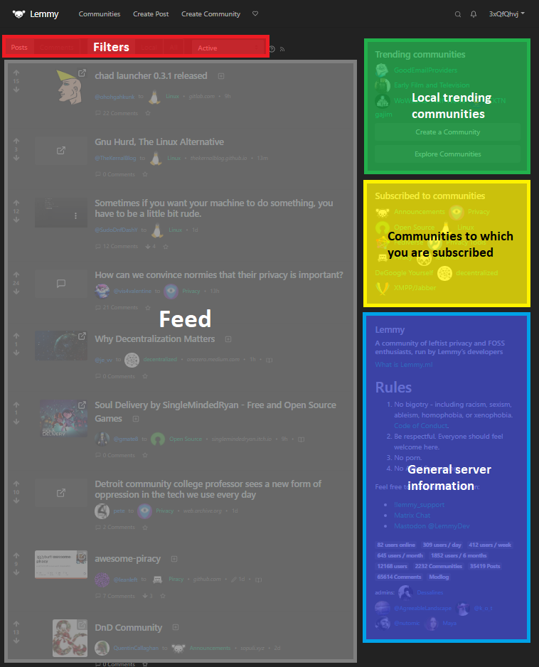

# Lemmy quick start guide

So you want to join Lemmy and get posting. Great! Here's how to dive straight in.

## Let's start with the basics. What is this?

[Lemmy](https://github.com/LemmyNet/lemmy) is similar to sites like [Reddit](https://reddit.com/), [Lobste.rs](https://lobste.rs/), [Raddle](https://raddle.me/), or [Hacker News](https://news.ycombinator.com/): you subscribe to forums you're interested in, post links and discussions, then vote, and comment on them. Behind the scenes, it is very different; anyone can easily run a server, and all these servers are federated (think email), and connected to the same universe, called the [Fediverse](https://en.wikipedia.org/wiki/Fediverse).

*The word “fediverse” (federated universe) refers to the network of all Lemmy servers [and other projects](https://blog.joinmastodon.org/2018/06/why-activitypub-is-the-future/), users of which are able to talk to each other seamlessly.*

Like email, wherever you sign up on GMail or Outlook, you know you’ll be able to email everyone you need to so long as you know their address. On Lemmy you'll be able to subscribe to communities on any other server, and can have discussions with users registered elsewhere.

This means there’s no big uncaring company running it all, no shareholders, no central control, none of the targeted advertising we’re all fed up with, just a bunch of people sharing the things they want to share with each other.

## Where do I sign up?

The first thing you have to do is **choose your server**. This is an extra step compared to sites like Reddit, but isn’t as difficult as it may seem.

*Like with email, your identity is hosted by the server you sign up on. So for example, I joined lemmy.ml so to mention me you can type @retiolus@lemmy.ml in your post.*

If what you want to talk about most fits into a clear category (maybe it’s video games or art or queer life or coding or fiction or whatever) then it might be worth making your first server one where that will primarily host that sort of content – it’ll be easier to make connections and find like-minded folk. Some consider your server to be like a neighbourhood or a venue where the general chatter can have a specific focus.

*You have the ability to view all public local posts that have been made by people on your server in the so-called “Local” tab.*

If you aren’t here to stick mainly to one topic, you’ll likely want to pick a server that caters to general interests. Either way, there’s a helpful servers list on [join-lemmy.org](https://join-lemmy.org/instances).

**Don’t panic!** You’ll be able to chatter to people on other servers, no matter which one you choose. Remember, this is like email and you can still email your mum on her ancient Yahoo account from your GMail, for example.

## Knowing your server

Take a moment before registering to check out the rules of your chosen server and make sure they are compatible with how you want to be posting.

Servers usually define their rules in a simple way on the sidebar on the right of the site. From top to bottom, you will usually find the list of "Trending communities" followed by "Subscribed to communities", a brief description of the server, the rules, some stats and the username of the administrators.

Admins are super friendly people who are usually running the server out of their own pocket so it’s good to get to know them like you would a landlord. Many accept donations to cover the running costs and if you’re able to contribute then it’s always appreciated.

## I think I found my new home!

Head to the Login page `(https://your.server/login)` of your server and choose your username and password in the sign up form. You don't need an email to register, but this is the only way to reset your password if you lose it.

Next thing to do is upload your profile picture, give the settings page `(https://your.server/settings)` a good once-over (and do come back to it when you’ve been on Lemmy a week or so just to make any tweaks that might help your experience) and get ready to introduce yourself.

*Some interesting settings worth checking are: your default feed sorting filter bewteen subscribed, local or all and your default sorting type.*

While you can simply enjoy reading Lemmy, the real fun begins as you dive in and start participating yourself by posting, voting and commenting.

To share a post, click the “Create Post” button on the top side of the screen. You’ll be taken to a form where you can enter an URL of the link or upload your image and input a title and body for the post. You will also need to enter the communitie where you’d like your post to appear. Before doing so, it’s a good idea to head to that communitie’s page and read the posting guidelines that appear on the right side of the screen. This will ensure you are abiding by the particular ethos of the communitie. For example, on the `!privacy` communitie, you are not allowed to promote proprietary software.

When all the fields are filled out, click “Create” and your post will go live.

By writing a new post or comment start typing...

- `@a_user_name` to get a list of usernames.
- `!a_community` to get a list of communities.
- `:emoji` to get a list of emojis.

## A quick tour of the web interface



The standard Lemmy interface has a single feed. You can change the content of the feed by using the filters:

**Subsribed** includes the posts of people on your server and on other servers, all that matters is that it’s people you follow.

**Local** is the feed of all the posts of people on your server. On many servers, particularly smaller ones and ones focused on a particular topic, this is where the magic happens. You can reply to people from there and it’s a great place to meet people who share the same interests as you.

**All**, or the **federated timeline** is a view of all the public posts your servers knows about from across the whole network (including local ones). The most common reason that something appears in the federated timeline is that someone from your server follows the author of that post.

| Type | Description |
| --- | --- |
| Posts | Only displays publications |
| Comments | Displays only comments |
| \-\-\- | \-\-\- |
| Active | Trending sort based on the score, and the most recent comment time. |
| Hot | Trending sort based on the score, and the post creation time. |
| New | Newest items. |
| Most Comments | The posts with the most comments. |
| New Comments | The posts with most recent comments, IE a forum-style sort. |
| Top | The highest scoring items in the given time frame. |

For more detail, check the [Post and Comment Ranking details](https://join-lemmy.org/docs/en/about/ranking.html).

## Using Markdown

Lemmy's posts are done using Markdown, there are of course shortcuts for you to use when writing but here is a table to help you if you want to go further.

| Type | Or  | … to Get |
| --- | --- | --- |
| \*Italic\* | \_Italic\_ | *Italic* |
| \*\*Bold\*\* | \_\_Bold\_\_ | **Bold** |
| \# Heading 1 | Heading 1<br>========= | #### Heading 1 |
| \## Heading 2 | Heading 2<br>\-\-\-\-\-\-\-\-\- | ##### Heading 2 |
| \[Link\](http://a.com) | \[Link\]\[1\]<br>⋮<br>\[1\]: http://b.org | [Link](https://commonmark.org/) |
| !\[Image\](http://url/a.png) | !\[Image\]\[1\]<br>⋮<br>\[1\]: http://url/b.jpg |  |
| \> Blockquote |     | > Blockquote |
| \* List<br>\* List<br>\* List | \- List<br>\- List<br>\- List | \* List<br>\* List<br>\* List |
| 1\. One<br>2\. Two<br>3\. Three | 1) One<br>2) Two<br>3) Three | 1\. One<br>2\. Two<br>3\. Three |
| Horizontal Rule<br>\-\-\- | Horizontal Rule<br>\*\*\* | Horizontal Rule<br><br>* * * |
| \`Inline code\` with backticks |     | `Inline code` with backticks |
| ```<br>\# code block<br>print '3 backticks or'<br>print 'indent 4 spaces'<br>``` | ····# code block<br>····print '3 backticks or'<br>····print 'indent 4 spaces' | \# code block<br>print '3 backticks or'<br>print 'indent 4 spaces' |
| ::: spoiler hidden or nsfw stuff<br>*a bunch of spoilers here*<br>::: |     | <details><summary>hidden or nsfw stuff</summary><br><br>*a bunch of spoilers here*<br><br></details> |
| Some ~subscript~ text |     | Some <sub>subscript</sub> text |
| Some ^superscript^ text |     | Some <sup>superscript</sup> text |

[CommonMark Tutorial](https://commonmark.org/help/tutorial/)
