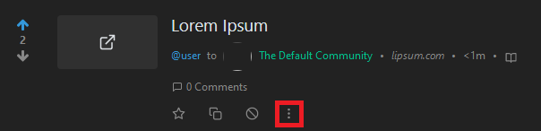

# Moderation actions

On Lemmy a **moderator** is someone who manages and has rights over a community.

An **administrator** has full rights on the entire server, and thus also in each community.

| Action | Result | Permission level |
| --- | --- | --- |
| lock | Prevents making new comments under the post | Moderator |
| sticky | Pin the publication to the top of the community listing | Moderator |
| remove | Delete the post | Moderator |
| ban | Ban user from the community | Moderator |
| appoint as mod | Gives the user moderator status | Moderator |
| appoint as admin | Gives the user administrator status | Admin |
| ban from site | Ban user from the server | Admin |

To take a moderation action on a user, you need a post from that user and click on the 3 dots at the bottom right of the title.

To undo an action previously taken on a user, the same process must be followed. As an example, if a post is locked, click on the lock icon again to unlock it.

