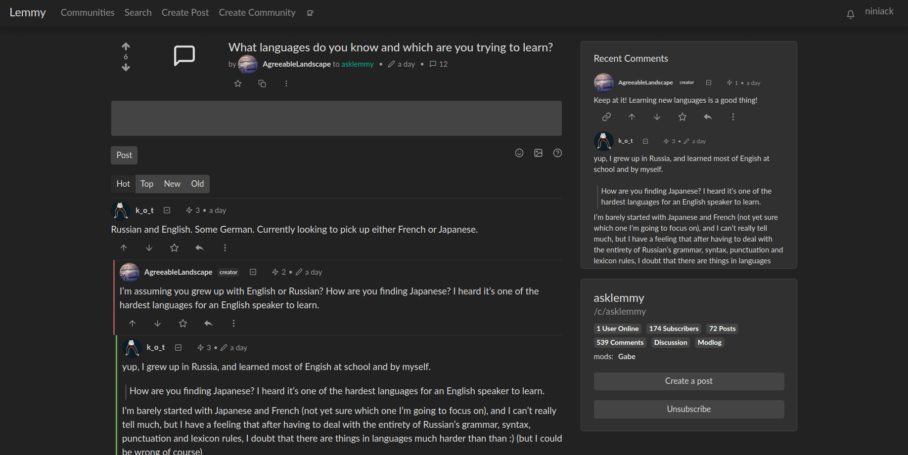

## Acerca del proyecto

| Página de inicio                      | Página de publicación                |
| ------------------------------------- | ------------------------------------ |
|  |  |

[Lemmy](https://github.com/LemmyNet/lemmy) es similar a sitios como [Menéame](https://meneame.net), [Reddit](https://reddit.com), [Lobste.rs](https://lobste.rs), [Raddle](https://raddle.me), o [Hacker News](https://news.ycombinator.com/): te subscribes a los foros que te interesan, publicas enlaces y debates, luego votas y comentas en ellos. Entre bastidores, es muy diferente; cualquiera puede gestionar fácilmente un servidor, y todos estos servidores son federados (piensa en el correo electrónico), y conectados al mismo universo, llamado [Fediverso](https://es.wikipedia.org/wiki/Fediverso).

Para un agregador de enlaces, esto significa que un usuario registrado en un servidor puede suscribirse a los foros de otro servidor, lo que le permite mantener discusiones con usuarios registrados en otros lugares.

El objetivo general es crear una alternativa a reddit/menéame y otros agregadores de enlaces, fácilmente auto-hospedada, descentralizada, y fuera del control e intromisión corporativa de éstos.

Cada servidor lemmy puede establecer su propia política de moderación; nombrando a los administradores del sitio y a los moderadores de la comunidad para mantener alejados a los trolls, fomentar un entorno saludable y no tóxico en el que todos puedan sentirse cómodos contribuyendo.

**La Federación está en constante desarrollo**

### ¿Por qué se llama Lemmy?

- Cantante principal de [Motörhead](https://invidio.us/watch?v=pWB5JZRGl0U).
- El [videojuego de la vieja escuela](https://es.wikipedia.org/wiki/Lemmings).
- El [Koopa de Super Mario](https://www.mariowiki.com/Lemmy_Koopa).
- Los [roedores peludos](http://sunchild.fpwc.org/lemming-the-little-giant-of-the-north/).

### Desarrollado Con

- [Rust](https://www.rust-lang.org)
- [Actix](https://actix.rs/)
- [Diesel](http://diesel.rs/)
- [Inferno](https://infernojs.org)
- [Typescript](https://www.typescriptlang.org/)
