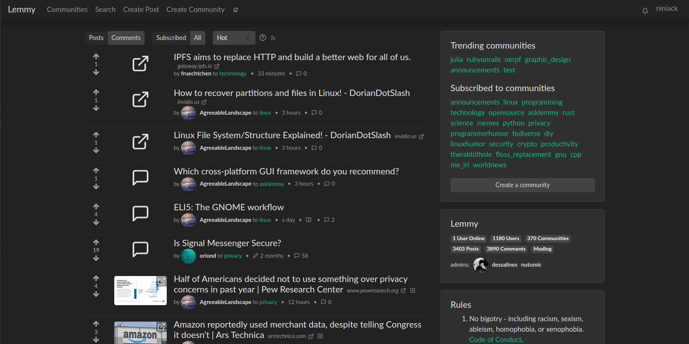

## À propos du pojet

Première page|Publication
---|---
|

[Lemmy](https://github.com/LemmyNet/lemmy) est similaire à des sites comme [Reddit](https://reddit.com), [Lobste.rs](https://lobste.rs), [Raddle](https://raddle.me) ou [Hacker News](https://news.ycombinator.com/) : vous vous abonnez aux forums qui vous intéressent, vous publiez des liens et des discussions, puis vous votez et commentez. Dans les coulisses, c'est très différent : n'importe qui peut facilement gérer un serveur, et tous ces serveurs sont fédérés (pensez au courrier électronique) et connectés au même univers, appelé le [Fediverse] (https://en.wikipedia.org/wiki/Fediverse).

Pour un agrégateur de liens, cela signifie qu'un utilisateur enregistré sur un serveur peut s'abonner à des forums sur n'importe quel autre serveur, et peut avoir des discussions avec des utilisateurs enregistrés ailleurs.

L'objectif global est de créer une alternative facilement auto-hébergeable et décentralisée à Reddit et à d'autres agrégateurs de liens, en dehors du contrôle et de l'ingérence des entreprises.

Chaque serveur lemmy peut définir sa propre politique de modération, en nommant des administrateurs pour l'ensemble du site et des modérateurs de communauté afin d'écarter les trolls et de favoriser un environnement sain et non toxique où chacun peut se sentir à l'aise pour contribuer.

*Note: La Fédération est toujours en développement actif*

### Pourquoi "Lemmy" ?

- Lead singer from [Motörhead](https://invidio.us/watch?v=pWB5JZRGl0U).
- The old school [video game](<https://en.wikipedia.org/wiki/Lemmings_(video_game)>).
- The [Koopa from Super Mario](https://www.mariowiki.com/Lemmy_Koopa).
- The [furry rodents](http://sunchild.fpwc.org/lemming-the-little-giant-of-the-north/).

### Construit avec

- [Rust](https://www.rust-lang.org)
- [Actix](https://actix.rs/)
- [Diesel](http://diesel.rs/)
- [Inferno](https://infernojs.org)
- [Typescript](https://www.typescriptlang.org/)
