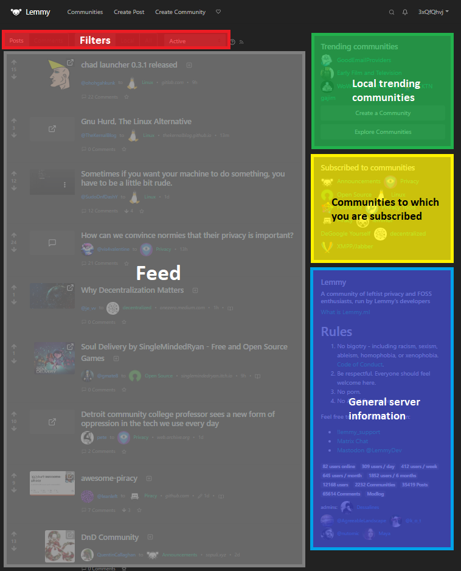

# Panduan Mulai Cepat Lemmy

Jadi Anda ingin bergabung dengan Lemmy dan mulai mengepos. Bagus! Begini cara untuk meluncur masuk.

## Di mana saya mendaftar?

Hal pertama yang Anda harus lakukan adalah **memilih peladen Anda**. Ini merupakan langkah tambahan dibandingkan dengan situs seperti Reddit, tapi tidak sesulit yang dikira.

_Seperti surel, identitas Anda dihos oleh peladen yang dimana Anda mendaftar. Jadi sebagai contoh, saya gabung ke lemmy.ml, jadi untuk menyebutkan saya, Anda bisa mengetikkan @retiolus@lemmy.ml di pos Anda._

Jika apa yang ingin Anda bicarakan sesuai dengan kategori yang jelas (mungkin itu permainan video atau seni atau kehidupan aneh atau pengkodean atau fiksi, dll.) maka mungkin ada baiknya membuat peladen pertama Anda di mana yang terutama akan menampung konten semacam itu – akan lebih mudah untuk membuat koneksi dan menemukan orang-orang yang berpikiran sama. Pikirkan peladen Anda sebagai lingkungan atau tempat, di mana obrolan umum tersebut dapat memiliki fokus khusus.

_Anda memiliki kemampuan untuk melihat semua pos lokal publik yang dibuat oleh orang di peladen Anda di bilah "Lokal"._

Jika Anda tidak di sini untuk menempel ke satu topik, Anda mungkin ingin memilih peladen yang melayani percakapan umum. Apa pun itu, ada daftar peladen yang berguna di [join-lemmy.org](https://join-lemmy.org/instances).

**Jangan panik!** Anda bisa berbicara kepada orang di peladen lainnya, tidak peduli apa yang Anda pilih. Ingat, ini seperti surel dan, contohnya, Anda masih bisa mengirim surel kepada ibu Anda di akun Yahoo kuno dari Gmail Anda.

## Ketahui peladen Anda

Luangkan waktu sejenak sebelum mendaftar untuk memeriksa peraturan dari peladen pilihan Anda dan pastikan mereka sesuai dengan bagaimana Anda ingin mengepos.

Peladen biasanya mendefinisikan peraturan mereka dengan cara yang simpel di bilah sisi kanan dari situs. Dari atas ke bawah, Anda akan biasanya menemukan daftar "Komunitas Sedang Tren" diikuti oleh "Berlangganan ke komunitas," deskripsi singkat peladen, peraturan, beberapa statistik, dan nama pengguna dari admin.

Admin merupakan orang yang sangat ramah yang bisanya menjalankan peladen dari dompet mereka sendiri, jadi merupakan hal yang bagus untuk mengenal mereka. Banyak dari mereka yang menerima donasi untuk menutupi biaya operasional dan jika Anda bisa berkontribusi maka hal itu selalu dihargai.

## Sepertinya saya menemukan rumah baru saya!

Pergi ke halaman Masuk `(https://your.server/login)` dari peladen Anda dan pilih nama pengguna dan kata sandi di formulir pendaftaran. Anda tidak perlu sebuah surel untuk mendaftar, tapi itu merupakan satu-satunya cara untuk mengatur ulang kata sandi Anda jika Anda kehilangannya.

Hal selanjutnya untuk dilakukan adalah mengunggah gambar profil Anda, berikan halaman pengaturan `(https://your.server/settings)` sebuah utak-atik (dan kembali melakukannya ketika Anda sudah di Lemmy selama beberapa pekan atau hanya untuk utak-atik yang mungkin membantu pengalaman Anda) dan bersiaplah untuk mengenalkan diri Anda.

_Beberapa pengaturan yang menarik untuk diperiksa adalah: jenis filter umpan baku antara berlangganan, lokal, atau semua dan jenis pengurutan baku Anda_

Meskipun Anda bisa hanya santai membaca Lemmy, keseruan yang asli dimulai ketika Anda meluncur dan mulai berpartisipasi dengan mengepos, mengeluarkan pilihan, dan berkomentar

Untuk membagikan sebuah pos, klik tombol "Buat Pos" di sisi atas dari layar. Anda akan dibawa ke sebuah formulir di mana Anda bisa memasukkan URL dari tautan atau mengunggah gambar Anda dan memasukkan judul dan badan pos. Anda juga akan diharuskan untuk memasukkan sebuah komunitas di mana Anda ingin pos Anda muncul. Sebelum melakukan itu, merupakan ide yang bagus untuk menuju ke halaman komunitas tersebut dan membaca panduan mengepos yang ada di sebelah kanan layar. Ini akan memastikan bahwa Anda patuh terhadap etos tertentu dari sebuah komunitas. Contohnya, di komunitas [`!privacy@lemmy.ml`](https://lemmy.ml/c/privacy), Anda tidak boleh untuk mempromosikan perangkat lunak tidak bebas.

Ketika semua bagian sudah diisi, klik "Buat" dan pos Anda akan muncul.

Ketika menulis sebuah pos atau komentar baru, mulai mengetik...

- `@a_user_name` untuk mendapatkan daftar nama pengguna.
- `!a_community` untuk mendapatkan daftar komunitas.
- `:emoji` untuk mendapatkan daftar emoji.

## Pengenalan cepat tampilan web

Tampilan standar Lemmy memiliki satu umpan. Anda bisa mengubah konten dari umpan tersebut menggunakan filter:

**Berlangganan** termasuk pos dari peladen Anda dan peladen lainnya, yang terpenting adalah komunitas yang Anda ikuti.

**Lokal** adalah umpan dari semua pos di komunitas di peladen Anda. Di banyak peladen, terutama yang kecil-kecil dan terfokus ke topik tertentu, di sinilah sihir terjadi. Anda bisa membalas ke orang dari sana dan di sana merupakan tempat yang bagus untuk bertemu dengan orang yang berbagi minat yang sama denganmu.

**Semua** atau **lini masa terfederasi** adalah untuk melihat semua pos publik yang peladen Anda ketahui dari seluruh jaringan (termasuk yang lokal). Alasan yang paling umum ketika sesuatu tampil di lini masa terfederasi adalah ada seseorang dari peladen Anda mengikuti komunitas yang ada di peladen lainnya.

| Jenis                  | Deskripsi                                                            |
| ---------------------- | -------------------------------------------------------------------- |
| Pos                    | Hanya tampilkan publikasi (pos)                                      |
| Komentar               | Hanya tampilkan komentar                                             |
| \-\-\-                 | \-\-\-                                                               |
| Aktif                  | Urut yang tren berdasarkan skor dan waktu komentar yang paling baru. |
| Hangat                 | Urut yang tren berdasarkan skor dan waktu pembuatan pos.             |
| Baru                   | Yang terbaru.                                                        |
| Paling Banyak Komentar | Pos dengan komentar paling banyak.                                   |
| Komentar Terbaru       | Pos dengan komentar yang paling baru, alias urut gaya-forum.         |
| Teratas                | Skor terbesar di jangka waktu tertentu.                              |

Untuk detail lebih lanjut, periksa [detail Ranking Pos dan Komentar](ranking.md).

## Menggunakan Markdown

Pos Lemmy ditulis menggunakan Markdown, tentu saja ada pintasan untuk Anda gunakan ketika menulis, di bawah ini merupakan tabel untuk membantu Anda jika Anda ingin tahu lebih lanjut.

| Ketik                                                                                          | Atau                                                                                 | … untuk mendapatkan                                                                                            |
| ---------------------------------------------------------------------------------------------- | ------------------------------------------------------------------------------------ | -------------------------------------------------------------------------------------------------------------- |
| \*Miring\*                                                                                     | \_Miring\_                                                                           | _Miring_                                                                                                       |
| \*\*Tebal\*\*                                                                                  | \_\_Tebal\_\_                                                                        | **Tebal**                                                                                                      |
| \# Tajuk 1                                                                                     | Tajuk 1   =========                                                               | <h4>Tajuk 1</h4>                                                                                               |
| \## Tajuk 2                                                                                    | Tajuk 2  ---------                                                                | <h5>Tajuk 2</h5>                                                                                               |
| \[Tautan\](http://a.com)                                                                       | \[Tautan\]\[1\] ⋮  \[1\]: http://b.org                                         | [Tautan](https://commonmark.org/)                                                                              |
| !\[Gambar\](http://url/a.png)                                                                  | !\[Gambar\]\[1\] ⋮  \[1\]: http://url/b.jpg                                    |                                                     |
| \> Kutipan                                                                                     |                                                                                      | <blockquote>Kutipan</blockquote>                                                                               |
| \* Daftar  \* Daftar  \* Daftar                                                          | \- Daftar  \- Daftar  \- Daftar                                             | _ Daftar  _ Daftar  \* Daftar                                                                         |
| 1\. Satu  2\. Dua  3\. Tiga                                                              | 1) Satu 2) Dua 3) Tiga                                                         | 1. Satu 2. Dua 3. Tiga                                                                                   |
| Garis Horizontal  \---                                                                      | Garis Horizontal \*\*\*                                                           | Garis Horizontal  
                                                                                      |
| \`Kode di pos\` dengan petik terbalik                                                          |                                                                                      | `Kode di pos` dengan petik terbalik                                                                            |
| \`\`\` \# blok kode  print '3 petik terbalik or' print 'indentasi 4 spasi'  \`\`\` | ····\# blok kode ····print '3 petik terbalik or' ····print 'indentasi 4 spasi' | \# blok kode  print '3 petik terbalik or' print 'indentasi 4 spasi'                                      |
| ::: spoiler sembunyi atau sesuatu porno _sesuatu untuk disembunyikan_ :::                |                                                                                      | 

 sembunyi atau sesuatu porno 

<em>sesuatu untuk disembunyikan</em>

 |
| Teks ~bawah~ garis                                                                             |                                                                                      | Teks bawah garis                                                                                    |
| Teks ^atas^ garis                                                                              |                                                                                      | Teks atas garis                                                                                     |

[Tutorial CommonMark](https://commonmark.org/help/tutorial/)
