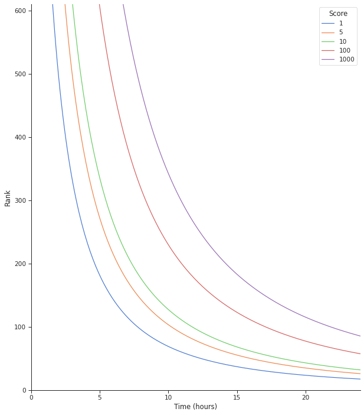

# Algoritma Pengurutan Tren/Hangat/Terbaik

## Tujuan

- Saat hari pertama, pos dan komentar baru harus berada di atas, sehingga mereka bisa dipilih atas/bawah.
- Setelah sekitar satu hari, faktor waktu akan hilang.
- Gunakan skala log, karena suara cenderung menggelinding, dan 10 suara pertama sama pentingnya dengan seratus berikutnya.

## Implementasi

### Reddit

Tidak memperhitungkan masa hidup utas, [memberikan komentar awal keuntungan besar terhadap yang setelahnya](https://minimaxir.com/2016/11/first-comment/), berefek lebih buruk di komunitas kecil. Jajak komentar baru berada di bawah utas, secara efektif membunuh diskusi dan membuat setiap utas balapan untuk komentar lebih dulu. Ini menurunkan kualitas pembicaraan dan menghargai komentar yang repetitif dan spam.

### Hacker News

Meskipun jauh lebih unggul daripada implementasi Reddit karena pembusukan skornya dari waktu ke waktu, [algoritma peringkat Hacker News](https://medium.com/hacking-and-gonzo/how-hacker-news-ranking-algorithm-works-1d9b0cf2c08d) tidak menggunakan skala logaritmik untuk skor.

### Lemmy

Menyeimbangkan efek bola salju suara dari waktu ke waktu dengan skala logaritmik. Meniadakan keuntungan yang melekat dari komentar awal sambil tetap memastikan bahwa suara tetap penting dalam jangka panjang, tidak menghapus komentar populer yang lama.

```
Rank = ScaleFactor * log(Max(1, 3 + Score)) / (Time + 2)^Gravity

Score = Upvotes - Downvotes
Time = time since submission (in hours)
Gravity = Decay gravity, 1.8 is default
```
- Lemmy menggunakan algoritma `Rank` yang sama di atas, dengan dua cara: `Active` dan `Hot`
  - `Active` menggunakan suara pos, dan waktu komentar terakhir (dibatasi hingga dua hari).
  - `Hot` menggunakan suara pos, dan waktu pos diterbitkan.
- Menggunakan Max(1, score) untuk memastikan semua komentar terpengaruh pembusukan waktu.
- Tambahkan 3 ke skor, sehingga semua yang memiliki kurang dari 3 pilih bawah akan tampak baru. Atau tidak, semua komentar baru akan tetap nol, dekat di bawah.
- Tanda dan abs skor diperlukan untuk menangani log skor negatif.
- Faktor skala 10 ribu menggenapkan peringkat dalam bentuk bilangan bulat.

Plot peringkat lebih dari 24 jam, dengan skor 1, 5, 10, 100, 1000, dengan faktor skala 10 ribu.



#### Penghitungan Pengguna Aktif

Lemmy juga menampilkan jumlah *pengguna aktif* untuk situs Anda, dan komunitasnya. Ini dihitung dalam `hari`, `pekan`, `bulan`, dan `setengah tahun` terakhir, dan ditembolokkan dalam pemulaian Lemmy, dan setiap jam.

Pengguna aktif merupakan seseorang yang mempos atau berkomentar di peladen atau komunitas dalam jangka waktu terakhir yang ditentukan. Untuk penghitungan situs, hanya pengguna lokal yang dihitung. Untuk penghitungan komunitas, pengguna terfederasi juga dihitung.
