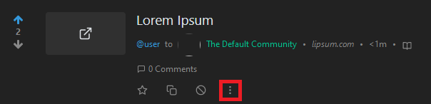

# Aksi moderasi

Di Lemmy, **moderator** adalah seseorang yang mengelola dan punya hak terhadap sebuah komunitas.

**Pembuat komunitas** merupakan **moderator** pertama sebuah komunitas karena mereka membuatnya.

Seorang **administrator** memiliki hak penuh terhadap seluruh apa yang ada di peladen, dan demikian juga terhadap seluruh komunitas.

| Aksi | Hasil | Tingkat izin |
| --- | --- | --- |
| kunci | Cegah membuat komentar baru di bawah sebuah pos | Moderator |
| tempel | Semat publikasi ke atas daftar komunitas | Moderator |
| hapus | Hapus pos | Moderator |
| larang | Larang pengguna dari komunitas | Moderator |
| angkat menjadi mod | Berikan pengguna status moderator | Moderator |
| angkat menjadi admin | Berikan pengguna status admin | Admin |
| larang dari situs | Larang pengguna dari peladen | Admin |

Untuk melakukan aksi moderasi pada seorang pengguna, Anda memerlukan pos dari pengguna tersebut dan klik 3 titik di kanan bawah dari judul.

Untuk mengurungkan aksi yang sebelumnya dilakukan pada seorang pengguna, proses yang sama harus diikuti. Seperti contoh, jika sebuah pos dikunci, klik pada ikon kunci lagi untuk membuka kuncinya.

