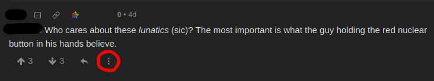
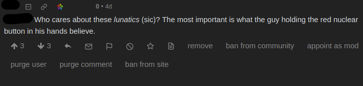

## Moderation

The internet is full of bots, trolls and other malicious actors. Sooner or later they will post unwanted content to any website that is open to the public. It is the task of administrators and moderators to remove such unwanted content. Lemmy provides many tools for this, from removing individual posts and issuing temporary bans, to removing all content submitted by an offending user.

Moderation in Lemmy is divided between administrators (admins) and moderators (mods). Admins are responsible for the entire instance, and can take action on any content. They are also the only ones who can completely ban users. In contrast, moderators are only responsible for a single community. Whereas admins can ban a user from the entire instance, mods can only ban them from their community.

The most important thing that normal users can do if they notice a rule-breaking post is to use the report function. If you notice such a post, click the flag icon to notify mods and admins. This way they can take action quickly and remove the offending content. To find out about removals and other mod actions, you can use the mod log which is linked at the bottom of the page. In some cases there may be content that you personally dislike, but which doesn't violate any rules. For this, there is a block function which hides all posts from a given user or community.

### Rules

Each instance has a set of rules to let users know which content is allowed or not. These rules can be found in the sidebar and apply to all local communities on that instance. Some communities may have their own rules in their respective sidebars, which apply in addition to the instance rules.

Because Lemmy is decentralized, there is no single moderation team for the platform, nor any platform-wide rules. Instead each instance is responsible to create and enforce its own moderation policy. This means that two Lemmy instances can have rules that completely disagree or even contradict. This can lead to problems if they interact with each other, because by default federation is open to any instance that speaks the same protocol. To handle such cases, administrators can choose to block federation with specific instances. To be even safer, they can also choose to be federated only with instances that are allowed explicitly.

### How to moderate

To get moderator powers, you either need to create a new community, or be appointed by an existing moderator. Similarly, to become an admin, you need to create a new instance, or be appointed by an existing instance admin. Community moderation can be done over federation, you don't need to be registered on the same instance where the community is hosted. To be an instance administrator, you need an account on that specific instance. Admins and moderators are organized in a hierarchy, where the user who is listed first has the power to remove admins or mods who are listed later.

All moderation actions are taken in the context menu of posts or comments. Click the three dot button to expand available mod actions, as shown in the screenshot below. All actions can be reverted in the same way.

| Action             | Result                                                                                                                                               | Permission level |
| ------------------ | ---------------------------------------------------------------------------------------------------------------------------------------------------- | ---------------- |
| Lock               | Prevents making new comments under the post                                                                                                          | Moderator        |
| Sticky (Community) | Pin the publication to the top of the community listing                                                                                              | Moderator        |
| Sticky (Local)     | Pin the publication to the top of the front page                                                                                                     | Admin            |
| Remove             | Delete the post                                                                                                                                      | Moderator        |
| Ban from community | Ban the user from interacting with the community, but they can still use the rest of the site. There is also an option to remove all existing posts. | Moderator        |
| Appoint as mod     | Gives the user moderator status                                                                                                                      | Moderator        |
| Ban from site      | Completely bans the account, so it cannot log in or interact at all. There is also an option to remove all existing posts.                           | Admin            |
| Purge user         | Completely delete the user, including all posts and uploaded media. Use with caution.                                                                | Admin            |
| Purge post/comment | Completely delete the post, including attached media.                                                                                                | Admin            |
| Appoint as admin   | Gives the user administrator status                                                                                                                  | Admin            |
